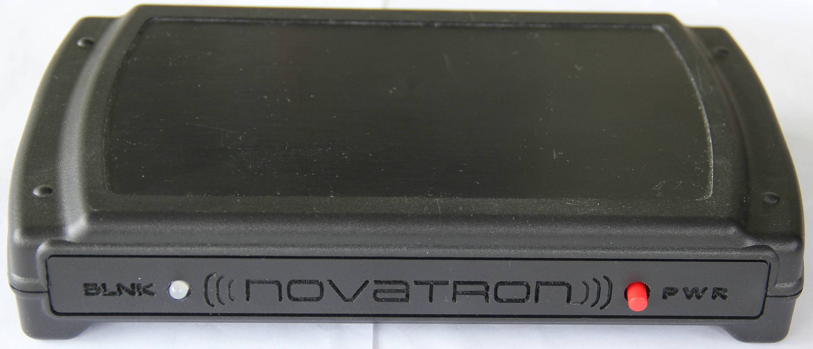
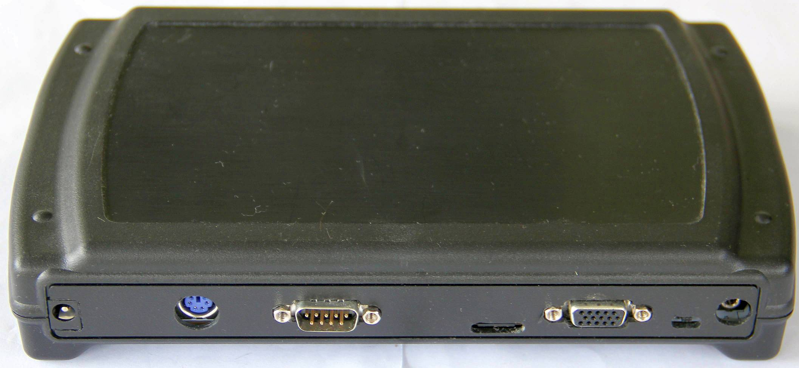

# Novatron
A few experiments and tests with my Novatron. It is a compact and improved clone of the Gigatron TTL computer.

Features:
- 128k RAM by default
- Banking and SPI SD card integrated
- PS/2 keyboard connector (PluggyMcPlugface)

## TSThDouble
First tests with the higher graphic resolution of the Novatron.

## My Novatron

