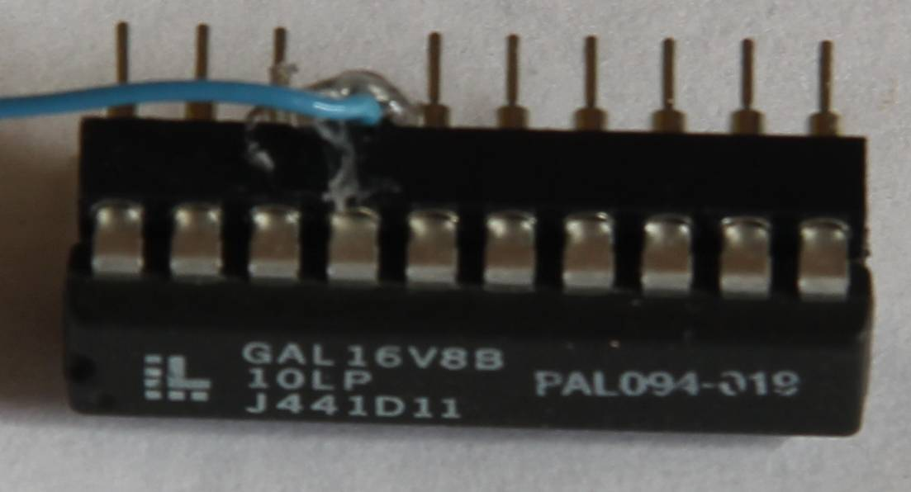

# Video Hack

I've been thinking about the Novatron's full graphics resolution. Since the 320x240 pixels quickly consume the entire RAM, there is hardly any memory left for programs.
The idea occurred to me to ban video memory in the upper 32k on a firm bank.
With a normal Gigatron, this has the advantage that almost the entire 64k of memory is free for the program. This means that Marcel's chess program will also run on a 128k Gigatron.
I was looking for a hardware solution. lb3361 has implemented this with software in ROM. That's exactly what his dev128k7.rom does.
Since the software solution is only about 2% slower than the hardware implementation, it should be the better way. The hardware remains unchanged and you are more flexible.

I still wanted to know if the hardware hack works. I have successfully tested it at Gigatron and Novatron.

## Novatron Hardware Hack

The /OL signal at the output register (U25 pin 1 74HCT377) is used to activate bank 1.
For this I need an input on the GAL. Pin 19 of the Novatron is still free, but it can only be used as an output and not as an input.
I disconnected BUS1 from pin 17 and connected pin 19 to BUS1. I used pin 17 as an input and connected it to /OL.
For this I used a second IC socket (see pictures). I have adjusted the GAL program accordingly.

I tested with dev7.rom and Marcel's chess program. The chess program and both SD cards work
I tested with dev7.rom and Marcel's chess program. The chess program and both SD cards work
